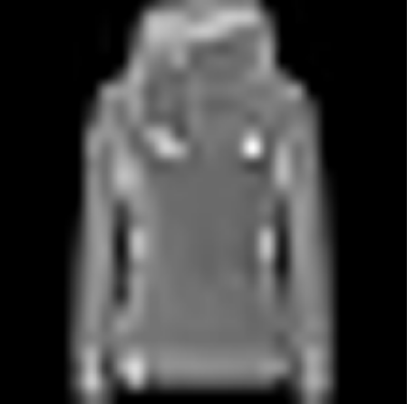
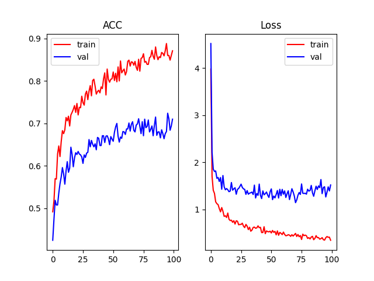
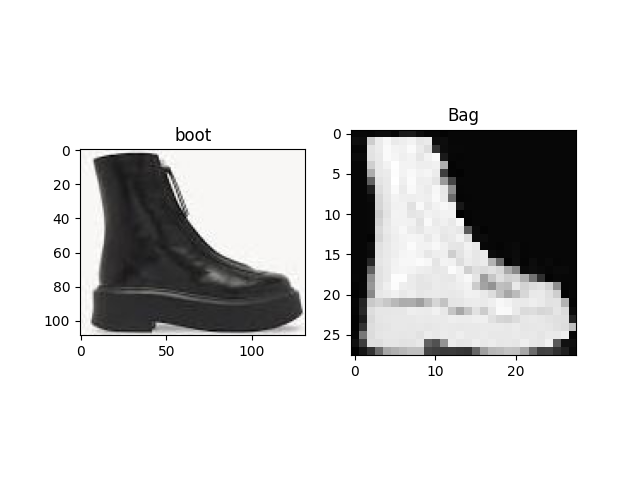
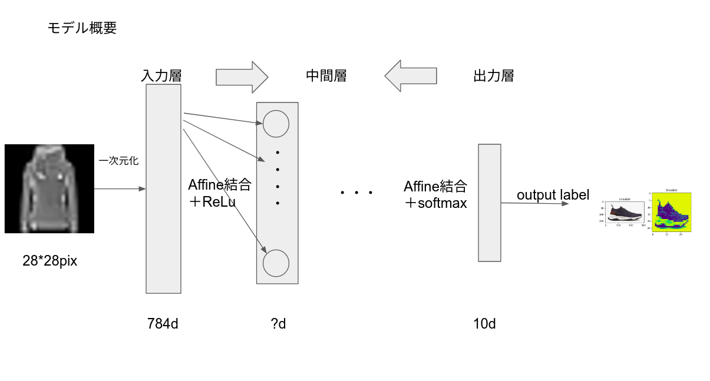

# Deep-learning from scratch
Author : Minegishi Gouki
### Prepare packages
```
pip install -r  requirements.txt
```
### Download data
```
python fasion_mnist.py
```
You can get 60000 images folder.
```
python make_small_dataset.py
```
You can get small dataset as blow.(train:1000,test:1000)  


### Train
1, Setting config file
```
mid_num: 8                          # 中間層の深さ
img_size: 28                        # 入力画像のサイズ
mid_dim: 50                         # 中間層のニューロン数
mid_dim2: 25                        # 中間層のニューロン数2
p_noise: 0                          # ノイズの割合(0~1)
optim: SGD                          # 最適化方法
lr : 0.01                           # 学習率
epoch: 100                          # エポック数
data_path: small_dataset　　　　　　  # dataの相対パス
data_num: 1000                      # 1エポックに学習するデータの数
lam : 0                             # 正則化のペナルティ
ord_idx : 2                         # 正則化の方法(L0,L1,L2ノルム)
label_dic: 　　　　　　　　　　　　     # ラベル
    Top: 0
    Trouser: 1
    Pullover: 2
    Dress: 3
    Coat: 4
    Sandal: 5
    Shirt: 6
    Sneaker: 7
    Bag: 8
    Boot: 9
```
2, train
```
python train.py
```
You can get 1 image file(learning curve) and 1 binary file(weight file) as below.   


### Infernece
```
python infer.py -i [image dir path] -o [output dir path] -w [weight file path]
```
You can get inferwnced images in output folder.   
  
### Model Overview

